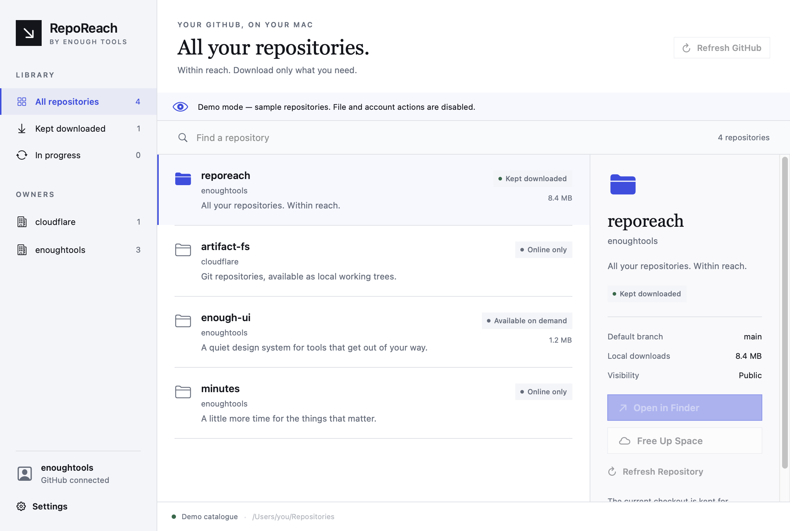

# RepoReach

**Every repo, within reach.** An open source Mac app by [Enough Tools](https://enoughtools.com).

RepoReach puts the GitHub repositories you can access in a folder you choose, grouped by owner. Browse the catalogue without cloning every repository. Open a repository to prepare its Git metadata, then download committed file contents as you read them. Keep a checkout downloaded for offline use, or reclaim its storage when it is recoverable from GitHub.

The app has a native SwiftUI management window, a background service, and Finder contextual actions. Closing the window keeps the service running; there is no menu-bar app.

[Website and downloads](https://reporeach.reb.run) · [Setup guide](docs/reporeach/user-guide.md) · [Architecture](docs/reporeach/architecture.md) · [Contributing](CONTRIBUTING.md)



## Beta status

RepoReach is an early beta built on a focused fork of [Cloudflare ArtifactFS](https://github.com/cloudflare/artifact-fs). Use disposable repositories first and keep backups of valuable local work. macOS 13 or later, Git, and a separately installed [macFUSE](https://macfuse.github.io/) kernel backend are required. Apple Silicon setup can require Recovery approval and Reduced Security; read the [platform setup guide](docs/reporeach/platform-setup.md) first. The download manifest identifies each build's signature, notarization status, source revision, and checksum.

See the [beta validation record](docs/reporeach/validation.md) for tested environments and remaining macOS installation checks. The initial release supports:

- GitHub sign-in through the bundled official GitHub CLI and discovery of accessible personal, collaborator, and organization repositories.
- One catalogue at a chosen mount folder, with lazy repository preparation and file hydration.
- A writable Git working tree backed by ArtifactFS, with ordinary commits and pushes.
- **Keep Downloaded**, **Free Up Space**, and explicit **Refresh** actions in the app and Finder extension.
- Persistent catalogue and pin state, progress reporting, and conservative checks before storage reclamation.

Keep Downloaded covers the current checkout. It does not promise complete offline history, every branch, Git LFS payloads, or submodule contents. Filesystem indexing and previews can read files and trigger downloads. RepoReach does not automatically commit or push your edits. Discovery reflects what your GitHub credential is authorized to access; organization restrictions may require additional authorization.

Free Up Space is intentionally conservative. The service checks the overlay, Git state, local refs, stashes, hooks, and other local data before reclaiming a repository. When it cannot establish that the repository is recoverable, it refuses the operation and reports the reason. It is not a backup system.

## Building from source

The filesystem engine requires Go 1.26 or later:

```sh
go build ./cmd/artifact-fs
go vet ./...
go test ./...
```

The native app requires macOS, Xcode 16 or later, and XcodeGen. The build script creates an architecture-specific app, ZIP, and disk image, including a checksum-verified official GitHub CLI and dependency license notices:

```sh
./scripts/build-macos.sh --arch arm64 --unsigned
./scripts/build-macos.sh --arch x86_64 --unsigned
```

Apple Silicon builds use an ad-hoc signature when `--unsigned` is selected. Developer ID signing and optional notarization are documented in the [release guide](docs/reporeach/releasing.md).

The marketing site uses the published [Enough UI](https://github.com/enoughtools/enough-ui) Astro components:

```sh
cd site
npm ci
npm run build
```

See [CONTRIBUTING.md](CONTRIBUTING.md) for native tests, actual FUSE tests, and the development workflow. The original upstream CLI remains available at `cmd/artifact-fs`; its [original documentation](docs/upstream/README.md) is retained for reference. RepoReach's desktop commands extend that same binary.

## Security and licensing

Repository contents and credentials connect directly to GitHub. The desktop control API uses a private local Unix socket. See [privacy and authentication](docs/reporeach/privacy-auth.md) and [SECURITY.md](SECURITY.md).

RepoReach and the ArtifactFS foundation are licensed under [Apache 2.0](LICENSE). Bundled GitHub CLI, Go dependency notices, Enough UI assets, and font licenses retain their respective licenses. GitHub, Cloudflare, Apple, and macFUSE are independent projects; RepoReach is an Enough Tools project.
