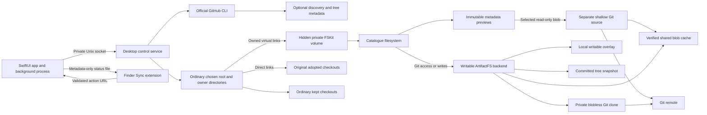

# RepoReach architecture

RepoReach combines a macOS management app with a Git-backed filesystem. Enough
Tools owns the desktop product; its engine comes from Cloudflare ArtifactFS and
retains `github.com/cloudflare/artifact-fs` as its Go module path. The
[product contract](product-contract.md) makes cold browsing and ordinary local
storage the acceptance priorities.

This document describes the native development implementation for macOS 26 or
later. Its bundled FSKit extension replaces the FUSE transport. Historical beta.3
builds mount the whole catalogue through separately installed macFUSE; their
installation requirements and validation do not establish acceptance of the new
implementation. See [Native FSKit](native-fskit.md) and the
[mounted acceptance record](fskit-acceptance.md) for proof status.

## Components

| Location | Responsibility |
| --- | --- |
| `native/App` | SwiftUI windows, background service lifecycle, sign-in, repository actions, and optional launch at login. |
| `native/FSKitExtension` | Bundled native transport and asynchronous bridge to the Go service. |
| `native/Shared` | Validated action URLs, bridge models, and metadata-only Finder status. |
| `native/FinderExtension` | Finder badges and actions; no Git execution or content reads for status. |
| `cmd/artifact-fs`, `internal/cli` | The sole engine executable and CLI entrypoints. |
| `internal/desktop` | Discovery/auth, source registration, visibility, metadata/content previews, owned links, and journaled checkout/cache handoffs. |
| `internal/catalogfs`, `internal/fsbridge` | Catalogue namespace, previews, activation, inode/handle translation, and private bridge protocol. |
| `internal/daemon` | Writable preparation, snapshots, hydration, and managed storage lifecycle. |
| `internal/fusefs` | Committed tree plus overlay, hydration, writable operations, and synthesized `.git`, shared by the transports. |
| `internal/gitstore` | Native Git subprocesses, filtered clones, binary content streaming, verification, and remote recovery checks. |
| `internal/snapshot`, `internal/overlay`, `internal/registry`, `internal/meta` | Persistent tree, overlay, registration, and SQLite support. |

The native transport bounds directory sessions at 128. Before rejecting a new
scan, it retires the least recently used completed EOF session; partial pages and
uncertain reference cleanup retain their owners. Lost release acknowledgements
remain recoverable. This prevents completed scans from exhausting admission
during repeated export inventories without increasing the session limit.

## Host layout and ownership

The state root is normally `~/Library/Application Support/RepoReach`. `engine/`
holds managed Git directories, tree metadata, overlays, and canonical blob caches
shared with preview reads. `previews/` holds independent browsing metadata and
manual metadata-acquisition Git state. Read-only content uses separate shallow
sources under `engine/repos/<storage-name>/preview-git/`. The hidden catalogue
mounts at `native-catalogue/volume` under the state root with `nobrowse`. The selected folder
is separate and is never covered by this mount. The standalone CLI similarly
distinguishes `ARTIFACT_FS_ROOT` from `daemon --root`.

The selected root and owner folders are ordinary directories. Exact-owned links
expose virtual entries or external adopted checkouts; materialized checkouts are
ordinary directories at their catalogue paths. Root and link receipts record
physical identities and expected targets. Publication refuses collisions or
replaced entries. Removal affects verified owned links, never foreign directories
or adopted contents. Hiding an entry can therefore leave its ordinary local
directory visible at its physical path.

Desktop schema 3 records `localPath` and `localKind` (`adopted` or `materialized`).
Readers accept schemas 1, 2, and 3, upgrade metadata in memory, and persist schema 3
on save. Legacy manual virtual entries remain separate managed checkouts; migration
does not reinterpret them as adopted originals or discard work. Older readers may
not open upgraded state. There is no downgrade serializer: preserve consistent
pre-upgrade state backups and subsequent local work.

## Cold browsing and activation

Discovery records identity, owner, branch, source URL, and privacy metadata. Root
and owner enumeration is local. Dormant repo listings and lookups use an immutable
preview without opening a writable runtime.

GitHub previews batch root trees through the official CLI's GraphQL API with
bounded concurrency. Roots bind to commits and subdirectories to tree objects.
Names, modes, object identities, and sizes are validated before publication.
Deeper trees load lazily; complete cached trees supply authoritative negative
lookups and survive restart. Failed or incomplete responses never publish empty
folders.

Manual remote or bare sources use a separate depth-one filtered Git acquisition
and canonical snapshot store. Local transports use shallow acquisition instead of
hardlink cloning. Source files and index are untouched. Servers that ignore
filters can transfer blobs. Unknown sizes are omitted from cheap native metadata;
a caller requiring an exact size can acquire just the selected immutable blob,
without preparing the writable engine. Native POSIX opens can request this size.

Read-only opens retain an immutable preview descriptor and defer bytes until a
read or exact-size request. Reads use a separate depth-one Git source bound to
the selected commit and stream the selected blob into the canonical shared cache.
Object identity and available size metadata are verified before publication.
Concurrent reads share acquisition, cached reads work offline, and unrelated
blobs are not requested on a filter-capable source. This does not activate a
writable runtime, create an overlay, or alter a source checkout's index. Symlink
targets use the same immutable content path. Receipt generations record owned
source/cache contents for safe reclamation.

The preview includes a known-size synthetic `.git` entry. Metadata lookup does not
prepare a clone; opening it prepares the real Git-directory pointer. Content
reads through ordinary preview files do not promote. Git access, writes, or
explicit preparation acquire the preview's selected commit and preserve inode
identity and existing handles. Prepared repos retain their writable view instead
of switching to a newer remote preview.

Unprepared Refresh quiesces the catalogue, retires the preview receipt, and
acquires a new immutable baseline. Retired handles keep their snapshots and cannot
overwrite the new receipt. Prepared native repos retain a persistent working-tree
baseline: Refresh fetches data without resetting the index or publishing a new
visible tree. Background HEAD watching and remote refresh remain disabled under
this policy. See [cache coherence](native-fskit.md#cache-coherence-is-a-release-gate).

## Adoption, visibility, and authentication

Remote and local bare sources register virtual repos. Nonbare adoption records
and directly links to the original checkout, preserving dirty files, staged work,
index, branch or detached HEAD, and configuration. Native Git inspects it without
creating a managed clone. Both operations work without GitHub sign-in.
GitHub-discovered sources use the scoped official CLI credential helper; manual
sources use native Git/SSH authentication.

Repo and owner disabled flags jointly determine virtual/link visibility.
Rediscovery retains individual choices and manual sources. Re-enabling an owner
does not clear repo exclusions. Hidden entries keep local data and pin intent but
do not start new virtual activation or pin downloads. Ordinary directories remain.
Visibility changes drain the native catalogue and fail if detachment is unsafe.
They do not revoke credentials or provide a network firewall.

Local checkout Refresh fetches its own remotes without resetting files or index.
Publishing remains an explicit Git operation; RepoReach does not auto-commit or
push.

## Keep and Free handoffs

Keep hydrates and verifies the current committed tree, refusing submodules and
checkout filters such as Git LFS. Missing selected blob identities are fetched in
bounded batches before binary-safe cache extraction, avoiding a lazy remote fetch
for every file. The bulk Git fixture acquired 188 selected blobs in two HTTP
requests and extracted cached data offline while preserving native Git state;
this is fixture evidence, not a network-performance guarantee.
It stages current merged files and the complete
existing private Git directory as a standalone checkout. Binary data, symlinks,
modes, timestamps, and supported extended attributes are copied and verified;
unsupported metadata causes refusal. Git refs and index are copied without
checkout or reset, with the worktree path changed to the ordinary destination.

Writes are frozen and cached catalogue preview identities are bound to the
authoritative writable runtime before the first inventory. Fingerprints are
rechecked, and the catalogue normally detached before publication. Inventory
change diagnostics use hashed identities to identify changed fields without
exposing local names. Export reads open close-on-exec file descriptors atomically,
so concurrent Git subprocesses cannot inherit them. A durable journal precedes
exclusive publication. Catalogue
state records the local checkout, registration is retired, and former engine
paths move to verified rollback storage. That retained copy uses additional space
until successful Free cleanup. Kept files remain accessible after app quit; the
operation does not promise every historical blob, LFS object, or submodule offline.

Free never removes adopted originals. For materialized checkouts it checks
ownership, dirty/staged/untracked/ignored files, local metadata, shared Git storage,
refs/reflogs/unreachable objects, custom configuration/hooks, and active access.
Fresh remote verification uses temporary Git state and must prove recoverability.
The owned checkout is moved aside and fingerprinted again before state commits to
virtual. Its owned link is published before verified checkout and rollback copies
are removed. Uncertain state is retained; incomplete cleanup is reported.
For a repo containing only preview content, Free pauses acquisition and normally
detaches before reclaiming verified immutable sources and cached blobs without
creating a writable runtime. It retains browsing snapshots and selected commits.
Recorded generation identities and a durable cleanup journal prevent adopting
unowned or changed cache data as disposable; incomplete cleanup is resumable.

Startup recovery precedes publication or mounting. Durable catalogue state and
journals determine whether to finish or roll back a transition. Changed bytes,
unexpected identities, or cleanup failures preserve data and block unsafe progress.
An interrupted Keep's retained copy is a standalone checkout, with its recovery
path reported persistently in status. Per-entry cleanup progress lets Free resume
after a partial verified deletion without demanding already removed files.

## Lifecycle and acceptance

Closing the window leaves the app and service running without a menu-bar item.
Quitting stops the owned service. Virtual links require reopening RepoReach;
adopted and kept folders stay independent. Finder status is an atomic
metadata-only cache, and action URLs are validated by the extension, app, and
service. Accepted actions publish running status before remote preparation;
progress includes unique-content and byte totals, and the Finder extension
refreshes visible child badges. Scoped process activity remains active during
accepted repository operations and ends when work completes. Finder callbacks
read fresh official selection/target URLs, recheck route eligibility, and dispatch
explicitly to the containing app; menu visibility alone does not prove execution.
Local16 avoids the sandbox-refused parent-bundle identity read, validates the exact
OS-registered application path with its compiled identifier, and explicitly opens
that app. Live Finder Refresh has verified this dispatch with the app/service
initially stopped. See
[Finder extension details](../../native/FinderExtension/README.md).

The installed signed local16 build at executable source `aa8021b` passed signed
packaging, 67 native UI tests, and production Finder typechecking. Live Finder
Refresh launched the stopped app/service and preserved checkout state, proving
shared dispatch. Keep used the local15 app button; no extra Finder Keep/Free cycle
was run. Unchanged Go/FSKit retains the local15 results below without a local16 rerun.

The prior installed signed local15 build at executable source `de3610c` passed ordered
Go checks and all three mounted fixtures on macOS 27.0.1 ARM64. Expanded dormant
Keep covers cached native attributes and unvisited contents in 160 descendant
directories, 207 regular files and one symlink, 208 unique blobs, prompt accepted
status, repeated inventories, and ordinary app-off reads. Primary/cold tests cover
dirty state, selective reads, safe Free, and
reacquisition. Actual Finder checks on local12 verified ordinary-root and nested preview
traversal without permission badges, selected-thumbnail hydration without writable
preparation, and public/nested context actions. The tested repository metadata
was already cached; fixture timings and UI capture duration do not establish
real-network cold Finder latency or release readiness. macOS 26 and Intel runtime
remain unqualified. Live Keep through the local15 management app also completed
for an existing 188-blob repository and produced an ordinary checkout with clean
native Git status. After normal app shutdown, Git status, HEAD, and README blob
reads still worked with lazy fetching disabled and no app, engine, or mounted
RepoReach volume. Its contents were already cached; the observation measures
conversion/app-off access, not network downloads. See
[the mounted record](fskit-acceptance.md),
[the user guide](user-guide.md), and
[Contributing](../../CONTRIBUTING.md) for visible behavior and engine invariants.
