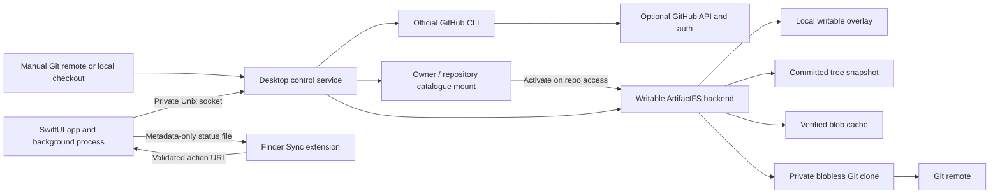

# RepoReach architecture

RepoReach combines a macOS management app with a Git-backed filesystem. Enough Tools owns the desktop product in this repository; the underlying engine comes from Cloudflare ArtifactFS and retains its Go module path, `github.com/cloudflare/artifact-fs`.

## Components

| Location | Responsibility |
| --- | --- |
| `native/App` | SwiftUI windows, background service lifecycle, GitHub sign-in progress, repository actions, and optional launch at login. |
| `native/Shared` | Validated action URLs and the metadata-only Finder status file. |
| `native/FinderExtension` | Finder badges and repository context-menu actions. It does not run Git or read repo contents to determine status. |
| `cmd/artifact-fs`, `internal/cli` | The engine executable and its CLI entrypoints. |
| `internal/desktop` | Optional GitHub discovery/auth, manual source registration, persistent catalogue/visibility state, local control API, and serialized repository operations. |
| `internal/catalogfs` | One FUSE mount containing owner/repo directories, lazy repository activation, and translation of repo-local inode and handle IDs. |
| `internal/daemon` | Repository registration, preparation, snapshots, watcher/hydrator lifecycle, current-tree downloads, and safe storage release. |
| `internal/fusefs` | Committed-tree plus local-overlay view, file hydration, writable filesystem operations, and the synthesized `.git` file. |
| `internal/gitstore` | Git subprocesses, blobless clones, content streaming, cache verification, and remote recovery checks. |
| `internal/snapshot`, `internal/overlay`, `internal/registry`, `internal/meta` | Persistent tree, overlay, repo registration, and SQLite support. |

The normal application data root is `~/Library/Application Support/RepoReach`. Its `engine/` child holds managed Git directories, SQLite metadata, overlays, and hydrated blobs. The selected mount root holds the visible filesystem view. It is not the data root. The standalone ArtifactFS CLI's `ARTIFACT_FS_ROOT` has the same distinction from `daemon --root`.

The saved desktop catalogue is schema version 2. Reading a version 1 catalogue migrates its metadata in memory, with version 2 persisted on the next save. This does not delete source or managed repository data. Previous beta readers cannot open version 2 state; there is no automatic downgrade serializer. Upgrade guidance must preserve app state and local work rather than suggest deleting a catalogue to get an older build running.

## Catalogue activation

GitHub discovery records identity, owner, description, default branch, clone URL, and privacy metadata. Manual adoption records a source URL/path and catalogue labels with `source: "manual"`; it requires no GitHub account. The source can be HTTP(S), `git://`, SSH, an SSH-style address, an absolute local path, or a local `file://` URL. Both bare repositories and nonbare checkouts are accepted. Native Git resolves source metadata, and preparation uses its selected branch: advertised default branch for remote sources or the branch of committed `HEAD` for a local checkout unless overridden. Registration stores a branch, not a frozen commit; deferred preparation acquires that branch's then-current committed state. It does not import the source checkout's index or dirty working tree.

Catalogue root/owner enumeration remains local. Registration is metadata-only; a repo opens when a caller enters it or asks for preparation/download. Acquisition requests a blobless clone and creates an initial committed-tree snapshot; individual file reads later hydrate blobs. Git servers or local transports that do not honor partial-clone filters can transfer more objects during preparation. Local source folders remain separate from the private managed clone.

Repos with the same name under different owners have separate namespaces. Desktop storage names are hashes of normalized `owner/name` identities. Catalogue metadata replacement is atomic; existing open handles retain their associated backend. Catalogue-level writes cannot create or rename GitHub repositories, and cross-repository moves return an error.

Prepared repository opening preserves the existing `HEAD` and staged index. The engine watcher reacts to local commits and branch switches, publishing a new snapshot and reconciling overlay entries. The base tree plus overlay makes the working directory writable without eagerly downloading all file bodies.

## Visibility and source authentication

Per-repo disabled flags and owner/organization disabled settings jointly determine catalogue visibility. Rediscovery retains individual choices and manual sources. Re-enabling an owner does not clear repo-level disabled flags. Owner grouping applies to matching manually labelled repos too.

Hidden entries retain their managed data and pin intent, are excluded from new catalogue activation, and do not run pin-loop downloads. Changes are rejected while affected explicit operations or lazy activation are busy. Catalogue metadata removal preserves existing activated backends and open handles, so those handles can still read or hydrate files. This is visibility policy, not credential revocation or a network firewall.

GitHub-discovered sources use the scoped official CLI credential helper; manual sources retain native Git/SSH authentication. The optional discovery account does not replace credentials for arbitrary manually added remotes. Refresh fetches from the selected source without auto-committing, resetting the index, or pushing. Ordinary Git operations remain the explicit publishing path.

## Download and release invariants

Keep Downloaded enumerates the current `HEAD` tree, deduplicates by blob identity, verifies cached content, fetches missing blobs, and rechecks `HEAD` before reporting completion. It refuses submodules and `.gitattributes` checkout filters such as Git LFS. Progress represents unique blobs rather than every path: two paths with identical content can share one download. Unknown sizes make byte totals a lower bound until resolved. Cancellation does not erase completed cache entries. The pin loop only processes enabled, visible pinned repositories.

Free Up Space first detaches the catalogue, stops readers, and serializes preparation/removal. It accepts only the expected engine-owned paths, refuses symlinked storage and specified local state, and verifies remote reachability using isolated temporary refs. A durable removal manifest is saved before disabling registration, and storage is moved aside with synchronized metadata before registry removal. Pre-commit failures attempt rollback; startup recovery runs before mounting. If final cleanup fails after registry removal, the error identifies the retained cleanup directory. Discovery state is stored independently, so a released repo can remain visible as online only.

Finder status is a separate cache, written atomically with private file permissions. The extension sends a strictly validated `reporeach://action` URL; the host app and service revalidate the repository and action. The containing app is not sandboxed. The Finder extension is sandboxed and uses a narrow read-only temporary exception for the status file; it has no App Store distribution claim. See [Finder extension details](../../native/FinderExtension/README.md).

## Scope of the beta

This is a FUSE filesystem, not an Apple File Provider extension. RepoReach controls the catalogue mount location and manages its own lazy content layer. It depends on separately installed macFUSE and requires a running local service.

Keep Downloaded is a current-tree availability operation. It is not a complete offline history, LFS/submodule client, general file backup, or automatic commit/push service. The management app's status polling is local; repository discovery and user-requested refresh are separate operations. See [the user guide](user-guide.md) for user-visible behavior and [Contributing](../../CONTRIBUTING.md) for development invariants and tests.
