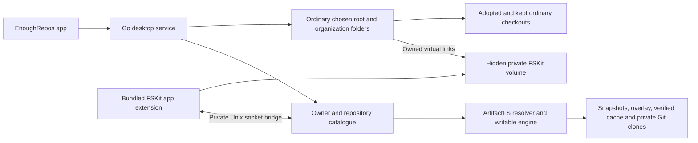

# Bundled native FSKit backend for macOS 26

EnoughRepos is developing its own FSKit filesystem extension for **macOS 26 or later**. The target setup is: install the app, enable EnoughRepos's File System Extension once in normal System Settings, and choose the folder where repositories appear. The app bundles the extension; this path requires no separate macFUSE installer, kernel extension, Recovery visit, or Reduced Security setting.

This is an implementation and acceptance record, not a claim that a production FSKit backend is available. The immutable beta.3 release and its [historical validation](validation.md) still describe the earlier FUSE transport. Its Linux mounts do not validate Apple's FSKit runtime.

The historical whole-root combined mounted run used clean Go helper `f47c1fd` with the unchanged installed beta.5 native app from `6c77f89`, on macOS 27.0.1 ARM64. Primary acceptance passes in 6.04 seconds and cold storage in 3.38 seconds, covering normal receipt-based remount, cold Keep, offline restart and clean Free/reacquisition as well as the primary Git/metadata sequence. Independent complete cached inspection confirms all seven disposable mount identities and four helpers absent, while the separate GUI catalogue remains live. This is not qualification of the upcoming beta.6 directory-performance changes or final native app. macOS 26 and Intel mounted runtime remain unqualified.

The current hybrid catalogue uses ordinary root/organization directories and a
hidden private FSKit volume. See the [architecture](architecture.md) and
[current acceptance record](fskit-acceptance.md) for subsequent implementation
and local runtime results. Historical records below retain their original app
names and source identities.

## Decision and folder placement

Apple delivers FSKit modules as app extensions that run in user space and integrate with the system's mount tools. EnoughRepos will retain its Git/storage engine behind a native adapter rather than add an external filesystem runtime to the app. See [Apple's FSKit overview](https://developer.apple.com/documentation/fskit).

The selected minimum is macOS 26 because the URL-based resource APIs used by this design, [FSGenericURLResource](https://developer.apple.com/documentation/fskit/fsgenericurlresource) and [FSPathURLResource](https://developer.apple.com/documentation/fskit/fspathurlresource), begin at 26.0. The framework's existence on earlier macOS versions does not establish support for this design there.

Apple's [passthrough sample](https://developer.apple.com/documentation/fskit/building-a-passthrough-file-system) also requires macOS 26 and Xcode 26. It enables the extension in **Settings > General > Login Items & Extensions > File System Extensions**, then mounts `~/Documents` at a separately created `~/passthrough-fs` folder. That is evidence that FSKit can mount at a chosen local path rather than only under `/Volumes`. EnoughRepos keeps its native mount in private app storage and exposes repositories under an ordinary chosen folder. Private backing-folder checks, source/storage separation, permissions, and supported-location tests still apply. The sample is evidence for the platform mechanism, not a mounted EnoughRepos test.

Source `f47c1fd` adds a private backing-folder receipt. Reuse can accept a sole OS-created `.fseventsd` only after an empty-folder inspection was followed by a successful native mount, with matching saved folder/volume identity and strict ownership, permission and system-directory checks. The name alone grants no exception; other entries or changed identity are refused without deleting their contents. Empty-folder support does not depend on persistent backing-volume identity.

## Engine and transport boundary

The native transport path is:

The extension translates FSKit file operations and item lifetimes into the existing engine's inode/handle operations. The Go service continues to own repository preparation, snapshots, overlay changes, Git subprocesses, hydration, pinning, and safe storage release. The native path adds a persistent working-tree policy for macOS 26, described below. It does not replace committed Git trees with API-generated files or move repository credentials into the extension.

Implementation must preserve these boundaries:

- Use the canonical `model.SnapshotStore`, `model.OverlayStore`, `model.Hydrator`, and Git-store contracts. Keep path normalization in `model.CleanPath()`.
- Keep file contents binary throughout the bridge. Bounded control metadata and filesystem bytes must have explicit framing and length limits; file bodies must not pass through text conversion. Reads continue to use verified cache contents and the binary-safe Git blob path.
- Restrict the bridge to private local storage and an authenticated local connection. Do not expose a TCP filesystem service, credentials in source URLs or command arguments, or unredacted credential diagnostics. The existing HTTP control socket's checks do not by themselves prove the new bridge's authorization.
- Preserve separate engine-owned storage, deferred acquisition, and original-checkout protection. Manual-source validation checks mount/state overlap and Git-directory redirection before initial or retried acquisition; this is not a claim of revalidation on every read or fetch.
- Preserve stable inode/handle identity, binary reads/writes, symlinks, directory cookies, error mapping, cancellation, and mount-owned teardown. An operation context ending must not discard a still-owned live mount or its bridge.

The extension, bridge, and desktop mount integration are under development. Exact wire operations and lifecycle behavior must be reviewed against the final source and tested together; this document does not turn an unimplemented operation into a supported feature.

The current [native project](../../native/project.yml) embeds an `extensionkit-extension` target named `RepoReachFSKit`, with identifier `com.enoughtools.reporeach.fskit` and deployment target 26.0, at `Contents/Extensions/RepoReachFSKit.appex`. The management app's older deployment target does not lower the filesystem backend's requirement. Its [module declaration](../../native/FSKitExtension/Info.plist) uses filesystem short name `reporeach`, advertises security-scoped path-URL resources, and excludes block resources. `FSActivateOptionSyntax` declares the common `-o` syntax used for read/write mount flags. Checking and formatting are not advertised because EnoughRepos does not implement them. The compiled-bundle validator rejects missing or unsupported activation syntax before signing or distribution.

The resource points to a private connection directory, not a repository checkout. [Bridge configuration parsing](../../native/FSKitExtension/BridgeConfiguration.swift) reads `connection.json`, version 1 metadata containing the Unix socket path and a local bearer secret. It requires an owned regular file with mode `0600`, rejects symlinks, bounds the file to 16 KiB, and redacts the secret from its debug description. The socket is a separate direct child of the module’s entitled macOS app-group container; the resource directory and repository storage stay in their existing locations. The [module lifecycle](../../native/FSKitExtension/RepoReachFileSystem.swift) holds the resource's security scope while loaded and releases it after volume shutdown drains. The Go mount helper selects filesystem type `reporeach` and supplies that resource directory and the chosen target path to the system mount tool. These are source contracts, not proof of installed authorization or a working mount.

The [Go bridge](../../internal/fsbridge/server.go) uses an AF_UNIX-only listener with mode `0600` inside the owned private app-group container. The parent app, Go engine and filesystem module claim the same Team-ID-prefixed group; Foundation resolves the container, and real access, ownership and Unix socket path bounds are checked. A source-scoped lock preserves one session when descriptor and socket directories differ. The engine removes only its own socket and descriptor after draining; the group container is never deleted. Apple [documents Team-ID-prefixed groups for macOS](https://developer.apple.com/documentation/xcode/accessing-app-group-containers) and [app-group socket placement](https://developer.apple.com/documentation/bundleresources/entitlements/com.apple.security.application-groups). It creates a fresh 32-byte local capability per mount, and the handler checks authorization before dispatch. The protocol uses HTTP framing: JSON for bounded operation metadata and binary bodies for file reads/writes and extended attributes, with a 1 MiB bound per binary request. It delegates to the existing catalogue/engine rather than create another Git or storage implementation. The adapter currently supports UTF-8 filenames and attribute names; special files and hard links are unsupported. These limits must remain explicit rather than treating a successful connection as complete POSIX filesystem coverage.

Directory enumeration uses captured snapshot/overlay metadata without hydrating unknown-size blobs. The wire format marks unresolved sizes explicitly; native listings omit those size attributes, while ordinary lookup/stat still resolves exact size. The extension keeps one bounded directory page per session for buffer-full continuation and releases its temporary references in batches of at most 1,024 pairs. Focused Go tests and 71 SDK 27 callback tests pass. Finder may request additional lookups/stat calls independently; first-open latency and the final installed performance build still require runtime measurement.

Bridge shutdown waits for calls before releasing tracked handles/lookups and attempting identity-checked connection cleanup. A timeout retains resources for a later drain attempt; daemon backing stores remain owned by the daemon. Native volume shutdown attempts flush/release/forget cleanup and records POSIX errors while continuing. That behavior is not a guarantee that every flush succeeded, and needs failure/recovery tests alongside normal teardown.

## Signing and build prerequisites

The extension needs Apple's [FSKit Module entitlement](https://developer.apple.com/documentation/bundleresources/entitlements/com.apple.developer.fskit.fsmodule), `com.apple.developer.fskit.fsmodule`. Apple's [capability table](https://developer.apple.com/help/account/reference/supported-capabilities-macos) lists FSKit Module for paid Apple Developer Program membership and Developer ID distribution, not the free Apple Developer account column.

A Developer ID signing certificate alone does not authorize the restricted extension entitlement. A matching identifier and provisioning profile must authorize the module and be embedded in the signed extension; Apple's [provisioning-profile explanation](https://developer.apple.com/documentation/technotes/tn3125-inside-code-signing-provisioning-profiles) describes this boundary. The Apple-authenticated production profile and its binding to the existing local Developer ID identity have passed independent review. Each complete release candidate still needs its own packaging, signature, installed activation and runtime evidence.

Distribution authorization and a local experiment are separate questions. In [Apple DTS's FSKit signing discussion](https://developer.apple.com/forums/thread/831843), a developer describes manual ad-hoc signing and an Apple engineer explains why it requires renewed GUI approval. That supports trying a locally signed module through normal approval without treating a missing distribution profile as proof that local testing is impossible. This experiment does not authorize distribution.

On October 5, 2026, the owner enabled the isolated ad-hoc app exported from [CI run 37360315981](https://github.com/enoughtools/reporeach/actions/runs/37360315981), native source `2ef65a4`. The real mounted acceptance attempt used helper checkout `6a62f2f` and stopped before attachment: `mount` reported that `reporeach` did not support operation `mount`. A repeat with bounded, redacted mount diagnostics added to that checkout identified the missing `FSActivateOptionSyntax` declaration. [Apple's mount implementation](https://github.com/apple-oss-distributions/diskdev_cmds/blob/cc6766b9d585a43609a24e0b9e56cf9665e63198/disklib/fskit_support.m#L110-L123) emits that error for this exact metadata omission, after finding the extension and checking its enabled state. Both private fixtures cleaned up normally without a volume having attached; these are failed attempts, not mounted passes.

The declaration is now corrected in source and regression-tested. Only the compiled test app's bundle metadata was patched; its filesystem Swift implementation matches native source `2ef65a4`. Re-signing replaced its registration identity. A subsequent disposable probe stopped during short-name discovery with `Unable to invoke task`; host logs showed no matching FSKit extension, with no RepoReach launch or attachment. This does not establish an AMFI, provisioning, or bridge failure.

The single isolated test app has since been relabeled as `com.enoughtools.reporeach.validation`, with filesystem module `com.enoughtools.reporeach.validation.fskit` and Finder module `com.enoughtools.reporeach.validation.finder`. Production identifiers are unchanged. [Apple DTS recommends separate development and release identifiers](https://developer.apple.com/forums/thread/804432) to avoid LaunchServices ambiguity when both are present. After normal registration and fresh owner approval, System Settings shows **RepoReach Validation Filesystem** enabled. Parent and individual module signatures verify; the immutable CI archive and installed beta.3 remain unchanged. The local experiment record preserves the archive hash, CI revision, and metadata changes separately from the helper checkout. Registration and enablement still do not establish successful execution or mounting.

The acceptance harness now checks public FSKit discovery before creating fixtures, requiring the selected identifier and exact module path to be the sole enabled filesystem advertising `reporeach` in the caller's inventory. This rejects competing candidates visible to that caller; it is a precondition rather than proof of which module the system mount dispatcher actually executes. The [read-only inspector](../../native/Tools/inspect-fskit-module.swift), built locally with SDK 15.5, still lists only Apple's three modules even after confirmed validation enablement. Host logs for the unentitled inspector show a Team ID lookup failure before the module set is returned. A separate inspector signed with the existing Developer ID identity for team `FGXHYHH9MC` also lists only those three Apple modules; the ad-hoc validation module has no Team ID. These observations support investigating caller/signing visibility as a possible explanation, but do not establish a cause, an SDK defect, or that the extension is disabled or absent.

Apple's [newer public mount API](https://developer.apple.com/documentation/fskit/fsclient/mountsinglevolume%28resource%3Abundleid%3Aoptions%3Acompletionhandler%3A%29) acknowledges caller visibility, while [the enumeration API](https://developer.apple.com/documentation/fskit/fsclient/fetchinstalledextensions%28completionhandler%3A%29) does not document a same-Team-ID rule or an SDK-based visibility difference. Public enumeration and the system mount tool use distinct discovery paths. Apple's [mount dispatcher](https://github.com/apple-oss-distributions/diskdev_cmds/blob/cc6766b9d585a43609a24e0b9e56cf9665e63198/disklib/fskit_support.m#L76-L99) found the earlier module and checked its enabled state before reporting the activation-metadata omission, even though public enumeration omitted it. An incomplete public inventory therefore cannot prove mount selection and stops the current acceptance harness before mounting. A standalone inspector built with SDK 26 or later can be exported or built locally with source/toolchain/checksum evidence, but there is no documented assurance that a newer SDK fixes caller visibility. No private API, registry reset, or security bypass substitutes for the missing evidence. No RepoReach volume has attached in these recorded attempts.

A separate no-configuration diagnostic after the validation extension was enabled did reach the exact verified executable path. On October 5, mount PID `35770` requested that validation module, and AMFI rejected its launch with error `-424`: “The file is adhoc signed but contains restricted entitlements.” FSKit returned ExtensionKit error 2 and mount exited 69. No module process or volume was observed. Private source and target directories contained no connection descriptor, broker or repository data; two `MNT_NOWAIT` checks confirmed no attachment before empty-directory cleanup. App/module hashes, signatures and registration stayed unchanged. This is evidence of selected launch **attempt** and a signing-policy rejection, not native execution or mounted acceptance. The appropriate profile and certificate are now a demonstrated local runtime requirement for this test module as well as a release gate. Apple lists [FSKit Module support for paid Developer Program and Developer ID signing](https://developer.apple.com/help/account/reference/supported-capabilities-macos/); enabling the Settings switch does not supply a provisioning profile.

The development Mac was upgraded by its owner to macOS 27.0.1 (26A434) on October 5, 2026. After the owner requested a local build, the existing Xcode installation was updated from 16.4/SDK 15.5 to Xcode 27.0 (27A266a) with SDK 27.0. The owner completed Xcode setup; `xcodebuild -checkFirstLaunchStatus` succeeds and the selected SDK reports 27.0. The complete Apple Silicon app, Finder extension and FSKit module compile locally and pass layout validation. All 52 unchanged XCTest methods pass in an isolated hostless package, and the actual Go–Swift socket and FSVolume callback integration tests pass with SDK 27. These checks do not launch the app or mount the filesystem. Fresh Xcode app builds automatically register their product with LaunchServices. An earlier incremental build omitted registration after passing `REGISTER_APP_WITH_LAUNCH_SERVICES=NO`, but a later fresh build still registered its product; that unsupported setting does not establish suppression. The build script now unregisters only its exact unsigned product after a successful build and verifies that product’s filesystem module is absent before packaging continues. It does not retire pre-existing products after a failed build or change other apps’ registrations. The selected ad-hoc validation module remains unchanged, and no production FSKit module was observed in the plug-in inventory. A Swift 27 capture warning was corrected by making the existing strong outer task capture explicit while retaining the weak stored handler. Xcode 26 or later with a macOS SDK at version 26 or later is sufficient; Xcode 27 with its macOS 27 SDK is an acceptable local route while preserving the module's macOS 26 deployment target. Use the [local compilation command](fskit-acceptance.md) and record the selected source/toolchain results. Compilation does not supply the missing distribution profile, prove installed execution, or constitute a mounted pass.

A module-only automatic development-provisioning attempt using the existing business certificate stopped before compilation or signing: Xcode reported `No Accounts` and rejected its cached wildcard profile because it does not authorize FSKit. No module, profile or registration step was produced by this attempt. After the owner signed in to Xcode, the same module-only attempt succeeded at clean source `bc9c77e`, using the existing business development certificate. Apple CMS, the exact certificate/team/module claims and this Mac’s device eligibility were verified independently. A separate complete validation app was assembled with that profile, unchanged compiled payloads and validation-only metadata; debugger entitlements and the production action URL handler were removed. All five component signatures and the final profile binding passed independent review. The old ad-hoc app remains unchanged on disk, while its exact registration was retired in favour of this signed copy; the existing published app’s registration and Applications link are preserved. The same-Team SDK 27 public inspector initially saw the exact new module with `enabled: false`, unlike the earlier ad-hoc inventory. The owner subsequently enabled the individual **RepoReach Validation Filesystem** control, and a fresh public inspection confirmed that exact identifier and path as the sole enabled candidate. The app-level aggregate switch had produced no recorded module-specific enable request; this does not establish a policy rejection. The mounted acceptance harness at helper source `24b6159` passed selection and attempted a mount at 22:10 UTC. The exact signed module launched as PID `47899`, passed AMFI profile evaluation and completed its FSKit listener/check-in, then returned `NSPOSIXErrorDomain Code=1` during probe. The mount tool exited 69; cached mount-table inspection confirmed no attachment, and the disposable fixture cleaned up normally. A separate diagnostic module at clean source `34613fc` retained the same approval. Its exact new executable launched as PID `69205`, and a bounded privacy-safe capture recorded `operation=connect errno=1` immediately before probe failed. No volume attached. This identifies the failing socket operation. Apple [explains that dynamically granted folder access does not grant Unix-socket access](https://developer.apple.com/forums/thread/788364); the app-group transport correction is implemented and has not yet established a mounted pass. This observation does not establish a documented general Team-ID visibility rule. The device-bound development profile is for local validation only and remains rejected by the Developer ID distribution validator.

The app-group correction at clean source `98a49f6` built as a complete ARM64 SDK 27 app, passed all 58 hostless native tests, and was signed as a new isolated validation copy using the same authenticated device-bound profile and certificate. The parent app’s headless Foundation resolver demonstrated real access to the entitled private container. After normal scoped registration, public discovery confirmed the exact new module as the sole enabled candidate without another approval. At 23:24 UTC, its exact executable launched as PIDs `88531` and `88532`; public dynamic signature validation and expected group/FSKit/sandbox claims passed. The kernel reported an attached `reporeach` volume owned by UID 501 at the disposable test folder. The reported source was the exact connection directory as a `file:` URL with a directory trailing slash. The strict ownership parser rejected that equivalent URL form, so the acceptance sequence stopped before repository reads or Git operations. The test helper was no longer running after the command returned; its exit cause is still being investigated; an ordinary, exact-volume unmount returned connection refused and the fixture was preserved. This proves native attachment and app-group connectivity, not a mounted acceptance pass. Source identity parsing and helper process-group isolation are corrected in source and covered by focused tests plus CLI build, vet and the complete Go suite. A plain-pipe runner comparison showed an inherited child disappearing while isolated children completed naturally; the original helper’s exact exit cause was not recorded. A separately reviewed private recovery utility restored the preserved capability on the actual production root/statfs handler after proving the old helper had exited and acquiring the original leases. The exact test volume then detached with ordinary `umount` at 00:52 UTC on October 6; cached global FSID/source absence, request drain and the utility’s normal exit were verified. Its descriptor and synthetic fixture were preserved in private evidence. This narrow cleanup utility is not a product resume API or a mounted acceptance pass. No forced detach or filesystem-daemon reset was performed.

A second mounted attempt used helper source `c1818e5` with that unchanged `98a49f6` module. It passed source identification, lazy owner/repository browsing, committed text and binary reads, symlink target/read checks and executable mode checks. Direct execution of the tracked script then failed with `EBADF`; the exact module's read callback returned errno 9 before normal deactivation. The harness stopped before Git staging/commit/checkout checks. Normal detach, helper exit and fixture removal succeeded. The executable vnode-read correction is described below; full mounted acceptance remains outstanding.

The read correction permits a temporary read-only descriptor when a retained
reader is absent. Apple's [executable loader](https://github.com/apple-oss-distributions/xnu/blob/main/bsd/kern/kern_exec.c)
reads a vnode's header before its open callback. Temporary reads preserve the
item's retained descriptors and open modes, record handle ownership even when
the caller is cancelled while opening, and await bounded release before the
operation drains. Hostless failure-case tests and the real Go/Swift callback
harness exercise the shared production read path. All nine focused tests and
refreshed Go/Swift callback integration pass. The cancellation regression fails
against the prior implementation, verifying that it detects lost ownership.

The complete `5ed6cb4` app passed local SDK 27 compilation, independently verified
development signing and all seven [CI jobs](https://github.com/enoughtools/reporeach/actions/runs/37398804775),
including both SDK 26 read suites. Its exact new module remained enabled and
executed the tracked script successfully on a real mounted path. Native Git HEAD
and clean-status reads also passed. The first tracked-file write returned
`EROFS`; PID `45308` returned errno 30 from its file-open callback at 01:30 UTC.
This proves dispatch into the module, without proving which write-policy input
caused the refusal. Normal cleanup, cached global attachment absence, helper
exit and fixture removal were confirmed. A narrow diagnostic now records only
resource-writability and read-only-policy Booleans plus static refusal text;
the diagnostic build preserved the existing policy and security checks.
The complete `7b98a2b` diagnostic copy reproduced the failure. Its exact volume
PID `52133` recorded `resourceWritable=false`, `explicitlyReadOnly=false` and
`selectedReadOnly=true` at 01:43 UTC, then logged the local write-open policy
refusal alongside errno 30. The connection URL describes the private descriptor
folder; repository data is written through the separately authorized app-group
bridge. Its resource flag therefore incorrectly made an otherwise writable
virtual tree read-only. Normal cleanup completed again.

The policy correction derives load access from the explicit `--rdonly` option.
Activation and mount callbacks honor ordered `-o` options, preserving read-only
access when later callbacks carry no access option. A hard load restriction
cannot be cleared, and changing effective access while mounted or holding
handles fails before any lifecycle request. Policy changes publish only after a
successful callback. The descriptor and app-group authorization checks remain
unchanged. All 22 focused production-volume tests pass, including binary
writes with a nonwritable descriptor resource, read-only mutation refusal,
option precedence, mounted and retained-handle restrictions, and failed-callback
rollback. The old resource-derived policy fails the binary-write regression.
The actual Go/Swift callback integration also passes; the complete corrected
app still requires complete mounted acceptance.

The complete `7ffeafb` app passed local SDK 27 build/signing review and all seven
[CI jobs](https://github.com/enoughtools/reporeach/actions/runs/37401727306),
including both SDK 26 test suites. Its exact mounted volume reported
`resourceWritable=false`, `explicitlyReadOnly=false`, `selectedReadOnly=false`.
Tracked file writes and native Git staging now pass. The next strict status check
found an unexpected untracked `._tracked.txt` metadata sidecar, so commit and
checkout acceptance remain unproved. The initial normal quit returned busy;
a later normal quit succeeded, complete cached inspection confirmed the exact
FSID and resource absent, and the detached helper exited after normal SIGTERM.
Read-only inspection of the detached fixture identified an AppleDouble v2
sidecar containing an 11-byte `com.apple.provenance` attribute. The originating
client is not recorded. Native extended-attribute persistence is required to
avoid this fallback without losing metadata. The disposable fixture is
preserved for metadata investigation. No forced
detach or registry reset was used.

[CI run 37362001784](https://github.com/enoughtools/reporeach/actions/runs/37362001784), at source `6a62f2f`, passed all seven jobs, including complete Apple Silicon and Intel app/module builds with Xcode 26.6, bundle layout, native tests, and Go–Swift bridge tests. It did not activate or mount the extension and predates the activation-metadata correction. [CI run 37372960522](https://github.com/enoughtools/reporeach/actions/runs/37372960522), at `e453faf`, passed Linux mounted filesystem checks, both macOS management builds and both complete SDK 26 products with native and bridge tests. Engine and website jobs were cancelled before acquiring hosted runners; no implementation step ran in those jobs. An explicitly requested [local-validation export](../../scripts/README.md) remains available for a compatible host without a suitable local Xcode and keeps signing keys on the local Mac. A successful mounted test here would establish macOS 27 behavior; macOS 26 mounted evidence would still need to be recorded separately.

[CI run 37397170300](https://github.com/enoughtools/reporeach/actions/runs/37397170300)
at `b116da6` passed all seven jobs, including the corrected app-group transport,
source-URL identity checks, helper process isolation and idempotent build-product
registration cleanup. Release publication remained disabled. It predates the
executable vnode-read correction and does not establish an installed native
mount pass.

Local verification does cover the real Go Unix socket, catalogue, snapshot, overlay, and hydrator with the production Swift bridge client, including binary data, directory pagination, authorization, error mapping, and cleanup. Core FSVolume callback tests use the installed SDK's real FSKit framework. These tests exercise the adapter without a kernel mount; they do not establish resource authorization, installed activation, or kernel cache behavior.

The metadata correction implements FSKit's native extended-attribute callbacks
over authenticated binary bridge operations. Attribute values are SQLite BLOBs;
create and replace policies, quotas, and namespace changes are transactional.
Opaque object identities let retained inodes keep their attributes after rename
or unlink without transferring them to a replacement at the same path. Catalogue
folders have a separate persistent store, so setting their metadata does not
activate or download a repository. The virtual `.git` file also has its own
metadata identity.

Attributes survive service restart, reconciliation, and Free Up Space. Eviction
preserves the private metadata database while removing recoverable Git/blob
caches; adopting the same repository reuses its metadata. Git commits and pushes
do not back up these local attributes. Bounds are 127 UTF-8 bytes per name, 1 MiB
per value, 128 attributes and 32 MiB per object, and 256 MiB per store. The focused
native suite passes 59 tests with warnings treated as errors, including binary
and empty values, policy errors, read-only refusal, and retained identities.
Real Go-to-SDK callback integration also passes.

The complete signed `8807963` validation app passed all seven
[CI jobs](https://github.com/enoughtools/reporeach/actions/runs/37408389657),
independent local SDK 27 payload/profile/signing review, and the full primary
mounted acceptance sequence on macOS 27.0.1 ARM64. Public discovery selected its
exact module as the sole enabled candidate, preserving the owner's approval.
Actual kernel calls passed binary and empty attributes, create/replace/default
policies, missing/remove errors, lists, short buffers, symlink `NOFOLLOW`, and
virtual `.git` isolation. Catalogue root/owner/repo attributes remained lazy.
Attributes persisted across branch changes, repo/org hide-show, explicit
unmount/remount and orderly helper restart. Git staging, commits and warm branch
checkout passed strict status with no AppleDouble sidecar.

The two-second normal unmount retry window resolves the previously observed
immediate post-close reconnect failure. Every retry rechecks the captured mount
identity; genuinely busy detach still refuses publication and preserves state
and handles. Complete cached inspection after the passing run found the captured
initial FSID and every RepoReach volume absent globally, both helpers exited,
and the fixture was removed. No forced detach was used. Cold Keep/offline
restart, clean Free/reacquisition, refresh and failure recovery remain separate
runtime gates; this macOS 27 result does not establish macOS 26 behavior.

Xcode's normal automatic Developer ID export obtained an Apple-authenticated
production FSKit profile authorizing the existing local Developer ID identity.
Its exact module/team/certificate binding and unrestricted distribution scope
passed independent review. The acquisition archive contains only native
components; it is not a shipping app. Complete production assembly, activation,
notarization facts and downloaded installation remain unproved.

## Cache coherence is a release gate

The earlier live FUSE policy can change a namespace or committed base outside filesystem calls when the watcher publishes a branch change or a repo/owner switch removes catalogue entries. Applying that policy unchanged to FSKit would require the kernel to discard obsolete contents, attributes, and directory entries.

In [Apple Developer Forums thread 821376](https://developer.apple.com/forums/thread/821376), an Apple DTS engineer explained in April 2026 that an explicit way to notify FSKit of changed content/attributes was not available at that time. Reclaiming an item is a lifetime callback, not evidence of cache invalidation. Later forum comments discuss macOS 27; Apple's [DataCacheHandler](https://developer.apple.com/documentation/fskit/fsvolume/datacachehandler) and [KernelCacheCoherencyAction](https://developer.apple.com/documentation/fskit/fsvolume/kernelcachecoherencyaction) APIs begin at macOS 27. Those APIs do not establish a macOS 26 solution.

The native implementation therefore selects [CatalogViewPersistentWorkingTree](../../internal/daemon/catalog.go). It preserves the initial working-tree snapshot plus filesystem overlay writes across reopen and service restart. Git `HEAD` and index changes alone do not replace the working-tree contents, and reopening a prepared repo does not reconcile away its overlay. The persistent runtime disables the background HEAD watcher and remote-refresh loop. Ordinary Git checkout changes must arrive as writes through the mounted working tree; explicit Refresh fetches source updates while preserving `HEAD`, branches, index, overlay, and visible file contents.

Keep Downloaded in this mode hydrates the persistent baseline as well as the current `HEAD` when they differ, so a metadata-only soft/mixed reset does not leave the mounted baseline uncached. There is no automatic baseline migration. This does not expand pinning into complete offline history, LFS, or submodule support.

Native discovery, manual adoption, and repo/owner visibility publication use a normal unmount before changing the catalogue, then reconnect it. A busy detach refuses the change rather than forcing the mount away or changing names behind cached items. The release must explain this reconnect/refusal behavior; it is different from the earlier live FUSE catalogue's ability to keep open handles after hiding an entry.

This policy avoids known out-of-band view changes. Recorded primary acceptance proves warm branch changes, orderly restart and repo/owner reconnects on macOS 27 ARM64 for the stated app/helper revisions. Refresh, explicit read-only operation, failure/recovery, and macOS 26/Intel mounted runtime remain separate gates. Go/bridge tests and successful compilation do not establish those kernel behaviors. Stale mounted views must not be advertised as live synchronization.

The persistent baseline is protected from normal Git garbage collection by the private `refs/reporeach/worktree-baseline` ref. Free Up Space refuses retained overlay changes and a baseline that differs from current HEAD; automatic baseline migration or compaction is not implemented.

## Failure and recovery gates

Normal app Quit requests a successful detach before stopping the helper, preserves mount intent for the next launch, and refuses a busy or uncertain detach. After successful quit preparation, further control requests cannot remount the volume. Forced process termination and external SIGTERM still need mounted failure/recovery acceptance; a process exit must not be mistaken for a successful kernel detach.

The private bridge currently refuses an existing socket rather than automatically reclaiming it after an unclean exit. Interrupted mount setup can retain ownership while the broker's cancellation outcome is uncertain. Recovery of stale sessions, uncertain setup, and replacement mounts remains a release gate. Actual acceptance must also verify unmount and remount of the same FSKit resource, including reused root items and invalidation of nonroot items from the previous session.

## Acceptance status

| Area | Current evidence or required proof |
| --- | --- |
| Platform mechanism and chosen folder | Apple documents macOS 26 URL resources, user-space extensions, normal extension enablement, and a mount at a chosen home-directory path. |
| RepoReach extension and Go bridge | Implemented and exercised through real local socket and FSVolume callback tests. No production mounted-backend claim. |
| SDK compilation | Complete app/extension ARM64 and Intel compilation and layout checks passed in macOS 26/Xcode 26.6 CI; ARM64 also passes locally with Xcode 27/SDK 27. |
| Latest combined mounted result | Helper `f47c1fd` with installed beta.5 native source `6c77f89` passes primary and cold acceptance on macOS 27.0.1 ARM64, including receipt-based remount. Independent scoped cleanup passes; beta.6 installed runtime remains pending. |
| Local activation experiment | The complete signed validation app passes the primary mounted sequence on macOS 27.0.1 ARM64: reads/execution, writes, Git commits/branch checkout, native metadata, busy refusal, repo/org reconnects, remount and orderly restart. Normal detachment and both helper exits are confirmed. |
| Cold storage | The `a708aba` test helper with source-equivalent preserved `8807963` native app passes cold Keep, exact unique-blob accounting, offline restart with zero remote requests, and clean Free/reacquisition preserving native metadata. All captured mounts and helpers detach normally. |
| Validation app replacement | Newly registered `a708aba` validation app fails helper dispatch before mounting in two attempts; public enablement passes. Restoring the preserved app succeeds. Registration/IPC logs do not establish the cause. Production installation remains a separate gate. |
| Distribution authorization | Matching Apple-authenticated FSKit Developer ID profile and existing local certificate binding pass. Complete ARM64 and Intel production candidates pass Apple notarization, stapling and Gatekeeper checks. The installed beta.5 native app participates in the ARM64 combined run above; beta.6 packaging and installed runtime need separate results. |
| Kernel cache coherence | Persistent working-tree and quiescent catalogue policies are implemented in source; actual macOS 26 mounted proof remains outstanding. |
| Existing beta.3 proof | Historical Go/native/Linux FUSE evidence remains valid for that release and is not FSKit evidence. |

Before publishing a native FSKit release, use disposable repositories and record all of the following:

1. Compile both supported architecture slices with an actual macOS SDK at version 26 or later, retaining the module's macOS 26 deployment target; validate the extension's profile, entitlements, signature, and distribution/notarization facts.
2. Install a downloaded build on a clean macOS 26 Mac, enable only the bundled File System Extension, and mount an empty chosen folder with no external filesystem installer or Recovery change.
3. Verify lazy catalogue browsing, text/binary reads, executable modes, symlinks, writes, rename/delete, directory enumeration, staging, commits, source preservation, and normal Git status.
4. Warm kernel caches, then switch branches, refresh, restart, and change repo/owner visibility. Assert exact contents, attributes, names, and Git status. Check fresh lookups after a completed reconnect, and clear refusal with preserved state/handles when readers make detachment busy. Establish the macOS 26 policy rather than infer it from bridge responses.
5. Exercise pinning, conservative Free Up Space refusal, reconnect/relocation, busy unmount, cancellation, extension/service failure, restart, and recovery without dropping staged or uncommitted work.

The [opt-in mounted acceptance harness](fskit-acceptance.md) prepares disposable local fixtures and covers the core Finder/Git/reconnect sequence once a matching installed module is available. The complete primary sequence now passes with the authorized development module on macOS 27.0.1. Its previous skip on macOS 15 is not mounted evidence. The remaining release gates above still require their own results.

Record results by source revision, macOS/Xcode versions, architecture, signing/profile state, and actual mounted environment. Update this status only from that evidence; keep previous release tags, manifests, artifacts, and validation records unchanged.
