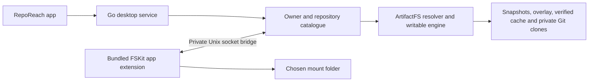

# Bundled native FSKit backend for macOS 26

RepoReach is developing its own FSKit filesystem extension for **macOS 26 or later**. The target setup is: install the app, enable RepoReach's File System Extension once in normal System Settings, and choose the folder where repositories appear. The app bundles the extension; this path requires no separate macFUSE installer, kernel extension, Recovery visit, or Reduced Security setting.

This is an implementation and acceptance record, not a claim that a production FSKit backend is available. The immutable beta.3 release and its [historical validation](validation.md) still describe the earlier FUSE transport. Its Linux mounts do not validate Apple's FSKit runtime.

## Decision and folder placement

Apple delivers FSKit modules as app extensions that run in user space and integrate with the system's mount tools. RepoReach will retain its Git/storage engine behind a native adapter rather than add an external filesystem runtime to the app. See [Apple's FSKit overview](https://developer.apple.com/documentation/fskit).

The selected minimum is macOS 26 because the URL-based resource APIs used by this design, [FSGenericURLResource](https://developer.apple.com/documentation/fskit/fsgenericurlresource) and [FSPathURLResource](https://developer.apple.com/documentation/fskit/fspathurlresource), begin at 26.0. The framework's existence on earlier macOS versions does not establish support for this design there.

Apple's [passthrough sample](https://developer.apple.com/documentation/fskit/building-a-passthrough-file-system) also requires macOS 26 and Xcode 26. It enables the extension in **Settings > General > Login Items & Extensions > File System Extensions**, then mounts `~/Documents` at a separately created `~/passthrough-fs` folder. That is evidence that FSKit can mount at a chosen local path rather than only under `/Volumes`. RepoReach's own empty-folder checks, source/storage separation, permissions, and supported-location tests still apply. The sample is evidence for the platform mechanism, not a mounted RepoReach test.

## Engine and transport boundary

The intended path is:

The extension translates FSKit file operations and item lifetimes into the existing engine's inode/handle operations. The Go service continues to own repository preparation, snapshots, overlay changes, Git subprocesses, hydration, pinning, and safe storage release. The native path adds a persistent working-tree policy for macOS 26, described below. It does not replace committed Git trees with API-generated files or move repository credentials into the extension.

Implementation must preserve these boundaries:

- Use the canonical `model.SnapshotStore`, `model.OverlayStore`, `model.Hydrator`, and Git-store contracts. Keep path normalization in `model.CleanPath()`.
- Keep file contents binary throughout the bridge. Bounded control metadata and filesystem bytes must have explicit framing and length limits; file bodies must not pass through text conversion. Reads continue to use verified cache contents and the binary-safe Git blob path.
- Restrict the bridge to private local storage and an authenticated local connection. Do not expose a TCP filesystem service, credentials in source URLs or command arguments, or unredacted credential diagnostics. The existing HTTP control socket's checks do not by themselves prove the new bridge's authorization.
- Preserve separate engine-owned storage, deferred acquisition, and original-checkout protection. Manual-source validation checks mount/state overlap and Git-directory redirection before initial or retried acquisition; this is not a claim of revalidation on every read or fetch.
- Preserve stable inode/handle identity, binary reads/writes, symlinks, directory cookies, error mapping, cancellation, and mount-owned teardown. An operation context ending must not discard a still-owned live mount or its bridge.

The extension, bridge, and desktop mount integration are under development. Exact wire operations and lifecycle behavior must be reviewed against the final source and tested together; this document does not turn an unimplemented operation into a supported feature.

The current [native project](../../native/project.yml) embeds an `extensionkit-extension` target named `RepoReachFSKit`, with identifier `com.enoughtools.reporeach.fskit` and deployment target 26.0, at `Contents/Extensions/RepoReachFSKit.appex`. The management app's older deployment target does not lower the filesystem backend's requirement. Its [module declaration](../../native/FSKitExtension/Info.plist) uses filesystem short name `reporeach`, advertises security-scoped path-URL resources, and excludes block resources.

The resource points to a private connection directory, not a repository checkout. [Bridge configuration parsing](../../native/FSKitExtension/BridgeConfiguration.swift) reads `connection.json`, version 1 metadata containing the Unix socket path and a local bearer secret. It requires an owned regular file with mode `0600`, rejects symlinks, bounds the file to 16 KiB, and redacts the secret from its debug description. The [module lifecycle](../../native/FSKitExtension/RepoReachFileSystem.swift) holds the resource's security scope while loaded and releases it after volume shutdown drains. The Go mount helper selects filesystem type `reporeach` and supplies that resource directory and the chosen target path to the system mount tool. These are source contracts, not proof of installed authorization or a working mount.

The [Go bridge](../../internal/fsbridge/server.go) uses an owned private directory and an AF_UNIX-only listener with mode `0600`. It creates a fresh 32-byte local capability per mount, and the handler checks authorization before dispatch. The protocol uses HTTP framing: JSON for bounded operation metadata and binary bodies for file reads/writes, with a 1 MiB bound per binary request. It delegates to the existing catalogue/engine rather than create another Git or storage implementation. The adapter currently supports UTF-8 filenames; special files, hard links, and extended attributes are unsupported. These limits must remain explicit rather than treating a successful connection as complete POSIX filesystem coverage.

Bridge shutdown waits for calls before releasing tracked handles/lookups and attempting identity-checked connection cleanup. A timeout retains resources for a later drain attempt; daemon backing stores remain owned by the daemon. Native volume shutdown attempts flush/release/forget cleanup and records POSIX errors while continuing. That behavior is not a guarantee that every flush succeeded, and needs failure/recovery tests alongside normal teardown.

## Signing and build prerequisites

The extension needs Apple's [FSKit Module entitlement](https://developer.apple.com/documentation/bundleresources/entitlements/com.apple.developer.fskit.fsmodule), `com.apple.developer.fskit.fsmodule`. Apple's [capability table](https://developer.apple.com/help/account/reference/supported-capabilities-macos) lists FSKit Module for paid Apple Developer Program membership and Developer ID distribution, not the free Apple Developer account column.

A Developer ID signing certificate alone does not authorize the restricted extension entitlement. A matching identifier and provisioning profile must authorize the module and be embedded in the signed extension; Apple's [provisioning-profile explanation](https://developer.apple.com/documentation/technotes/tn3125-inside-code-signing-provisioning-profiles) describes this boundary. The required FSKit-enabled Developer ID profile has not yet been supplied for this work. Existing beta signing success does not establish that the new extension can run.

Distribution authorization and a local experiment are separate questions. In [Apple DTS's FSKit signing discussion](https://developer.apple.com/forums/thread/831843), a developer describes manual ad-hoc signing and an Apple engineer explains why it requires renewed GUI approval. That supports trying a locally signed module through normal approval without treating a missing distribution profile as proof that local testing is impossible. On the updated development Mac, an isolated ad-hoc app from [CI run 37360315981](https://github.com/enoughtools/reporeach/actions/runs/37360315981), source `2ef65a4`, has passed strict component-signature checks and registered as `RepoReach Filesystem`. System Settings lists it disabled, pending user approval. Registration has not established execution or mounting, and this test product does not authorize distribution.

The development Mac was upgraded by its owner to macOS 27.0.1 (26A434) on October 5, 2026. Its active Xcode remains 16.4 with SDK 15.5, so it can run this backend after authorized installation but cannot compile the selected URL-resource implementation locally. Compilation requires Xcode 26 or later with the macOS 26 SDK. [CI run 37246599064](https://github.com/enoughtools/reporeach/actions/runs/37246599064), at source `c608801`, passed all seven jobs, including complete Apple Silicon and Intel app/module builds with Xcode 26.6, bundle layout, native tests, and Go–Swift bridge tests. It did not activate or mount the extension. An explicitly requested [local-validation export](../../scripts/README.md) can bring the compiled app to this Mac without exporting signing keys to CI. A successful mounted test here would establish macOS 27 behavior; macOS 26 mounted evidence would still need to be recorded separately.

Local verification does cover the real Go Unix socket, catalogue, snapshot, overlay, and hydrator with the production Swift bridge client, including binary data, directory pagination, authorization, error mapping, and cleanup. Core FSVolume callback tests use the installed SDK's real FSKit framework. These tests exercise the adapter without a kernel mount; they do not establish resource authorization, installed activation, or kernel cache behavior.

## Cache coherence is a release gate

The earlier live FUSE policy can change a namespace or committed base outside filesystem calls when the watcher publishes a branch change or a repo/owner switch removes catalogue entries. Applying that policy unchanged to FSKit would require the kernel to discard obsolete contents, attributes, and directory entries.

In [Apple Developer Forums thread 821376](https://developer.apple.com/forums/thread/821376), an Apple DTS engineer explained in April 2026 that an explicit way to notify FSKit of changed content/attributes was not available at that time. Reclaiming an item is a lifetime callback, not evidence of cache invalidation. Later forum comments discuss macOS 27; Apple's [DataCacheHandler](https://developer.apple.com/documentation/fskit/fsvolume/datacachehandler) and [KernelCacheCoherencyAction](https://developer.apple.com/documentation/fskit/fsvolume/kernelcachecoherencyaction) APIs begin at macOS 27. Those APIs do not establish a macOS 26 solution.

The native implementation therefore selects [CatalogViewPersistentWorkingTree](../../internal/daemon/catalog.go). It preserves the initial working-tree snapshot plus filesystem overlay writes across reopen and service restart. Git `HEAD` and index changes alone do not replace the working-tree contents, and reopening a prepared repo does not reconcile away its overlay. The persistent runtime disables the background HEAD watcher and remote-refresh loop. Ordinary Git checkout changes must arrive as writes through the mounted working tree; explicit Refresh fetches source updates while preserving `HEAD`, branches, index, overlay, and visible file contents.

Keep Downloaded in this mode hydrates the persistent baseline as well as the current `HEAD` when they differ, so a metadata-only soft/mixed reset does not leave the mounted baseline uncached. There is no automatic baseline migration. This does not expand pinning into complete offline history, LFS, or submodule support.

Native discovery, manual adoption, and repo/owner visibility publication use a normal unmount before changing the catalogue, then reconnect it. A busy detach refuses the change rather than forcing the mount away or changing names behind cached items. The release must explain this reconnect/refusal behavior; it is different from the earlier live FUSE catalogue's ability to keep open handles after hiding an entry.

This policy avoids known out-of-band view changes; it is not evidence of a macOS 26 invalidation API or a proven mounted result. Go unit tests, bridge tests, and successful compilation cannot establish kernel behavior. Production release remains gated on actual mounted branch-switch, refresh, restart, and repo/owner-visibility tests with warm caches. Stale mounted views must not be advertised as live synchronization.

The persistent baseline is protected from normal Git garbage collection by the private `refs/reporeach/worktree-baseline` ref. Free Up Space refuses retained overlay changes and a baseline that differs from current HEAD; automatic baseline migration or compaction is not implemented.

## Failure and recovery gates

Normal app Quit requests a successful detach before stopping the helper, preserves mount intent for the next launch, and refuses a busy or uncertain detach. After successful quit preparation, further control requests cannot remount the volume. Forced process termination and external SIGTERM still need mounted failure/recovery acceptance; a process exit must not be mistaken for a successful kernel detach.

The private bridge currently refuses an existing socket rather than automatically reclaiming it after an unclean exit. Interrupted mount setup can retain ownership while the broker's cancellation outcome is uncertain. Recovery of stale sessions, uncertain setup, and replacement mounts remains a release gate. Actual acceptance must also verify unmount and remount of the same FSKit resource, including reused root items and invalidation of nonroot items from the previous session.

## Acceptance status

| Area | Current evidence or required proof |
| --- | --- |
| Platform mechanism and chosen folder | Apple documents macOS 26 URL resources, user-space extensions, normal extension enablement, and a mount at a chosen home-directory path. |
| RepoReach extension and Go bridge | Implemented and exercised through real local socket and FSVolume callback tests. No production mounted-backend claim. |
| SDK compilation | Complete app/extension ARM64 and Intel compilation and layout checks passed in macOS 26/Xcode 26.6 CI. |
| Distribution authorization | Matching FSKit-enabled Developer ID provisioning profile is still missing. |
| Kernel cache coherence | Persistent working-tree and quiescent catalogue policies are implemented in source; actual macOS 26 mounted proof remains outstanding. |
| Existing beta.3 proof | Historical Go/native/Linux FUSE evidence remains valid for that release and is not FSKit evidence. |

Before publishing a native FSKit release, use disposable repositories and record all of the following:

1. Compile both supported architecture slices with the actual macOS 26 SDK; validate the extension's profile, entitlements, signature, and distribution/notarization facts.
2. Install a downloaded build on a clean macOS 26 Mac, enable only the bundled File System Extension, and mount an empty chosen folder with no external filesystem installer or Recovery change.
3. Verify lazy catalogue browsing, text/binary reads, executable modes, symlinks, writes, rename/delete, directory enumeration, staging, commits, source preservation, and normal Git status.
4. Warm kernel caches, then switch branches, refresh, restart, and change repo/owner visibility. Assert exact contents, attributes, names, and Git status. Check fresh lookups after a completed reconnect, and clear refusal with preserved state/handles when readers make detachment busy. Establish the macOS 26 policy rather than infer it from bridge responses.
5. Exercise pinning, conservative Free Up Space refusal, reconnect/relocation, busy unmount, cancellation, extension/service failure, restart, and recovery without dropping staged or uncommitted work.

The [opt-in mounted acceptance harness](fskit-acceptance.md) prepares disposable local fixtures and covers the core Finder/Git/reconnect sequence once a matching installed module is available. Its previous skip on macOS 15 is not evidence of a mounted pass. The updated macOS 27 host still needs an authorized, installed module before this test can run.

Record results by source revision, macOS/Xcode versions, architecture, signing/profile state, and actual mounted environment. Update this status only from that evidence; keep previous release tags, manifests, artifacts, and validation records unchanged.
